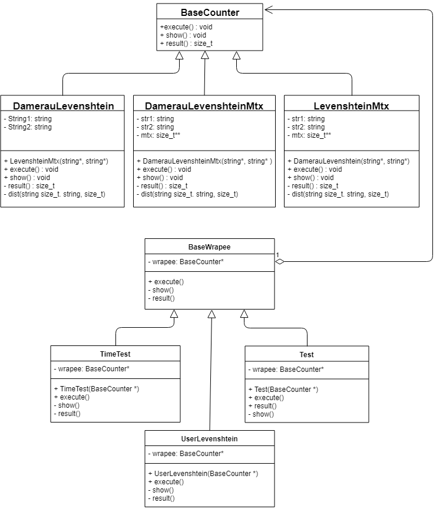
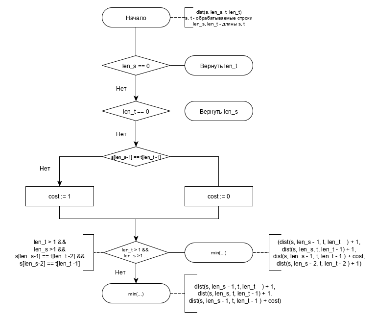
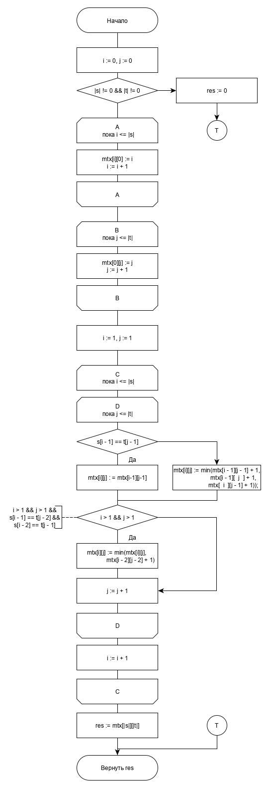
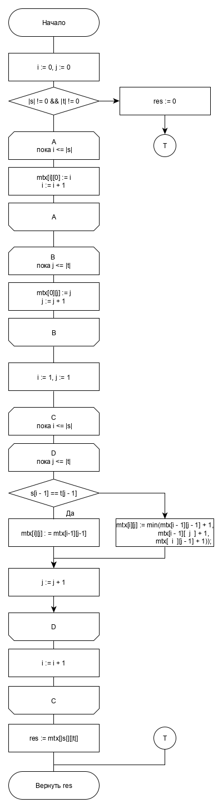
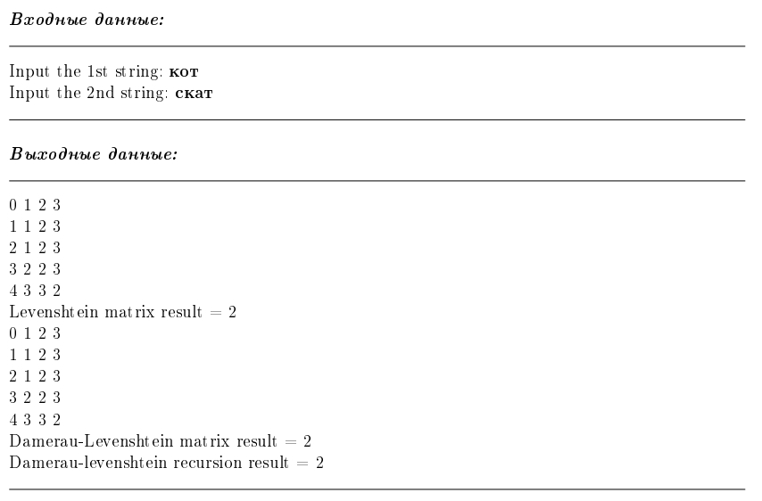
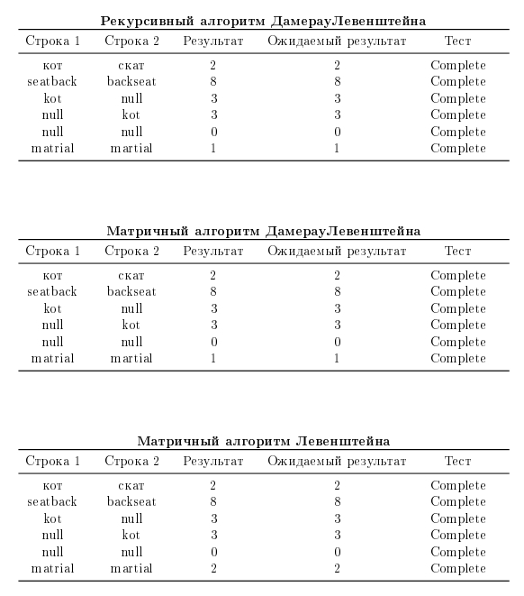
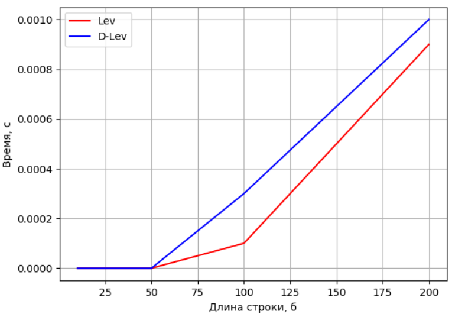
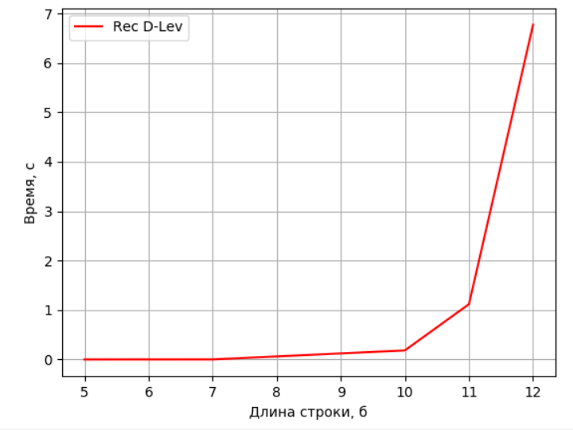

# Лабораторная работа №1 - Алгоритмы поиска редакционного расстояния
Консольное приложение, получает на вход 2 строки и вычисляет редакционное расстояние между ними тремя реализациями
Язык разработки: C++

## Задание на лабораторную работу 
* Реализовать матрично алгоритмы Левенштейна и Дамерау-Левенштейна, алгоритм Дамерау-Левенштейна рекурсивно; 
* Программа должна поддерживать два режима: пользовательский и экспериментальный.

## Диаграмма классов программы
Каждый алгоритм оформлен в отдельном классе, унаследованном от базового - {\it BaseCounter}. Каждый из классов хранит в себе обрабатываемые строки, классы _DamerauLevenshteinMtx_ и _LevenshteinMtx_ также содержат поле матрицы, которая заполняется во время выполнения алгоритма.  
Для режимов работы программы, пользовательского и экспериментального, используются TimeTest, Test и UserLevenshtein, которые представляют собой обертки, расширяющие функционал основных классов.

  

## Схемы алгоритмов

<b>Рекурсивный алгоритм Дамерау-Левенштейна</b>

  

<b>Матричные алгоритмы Дамерау-Левенштейна и Левенштейна</b>
 
  

 

## Пример работы программы

  

## Сравнение реализаций

  

<table><tr>
<td>  </td>
<td>  </td>
</tr></table>
